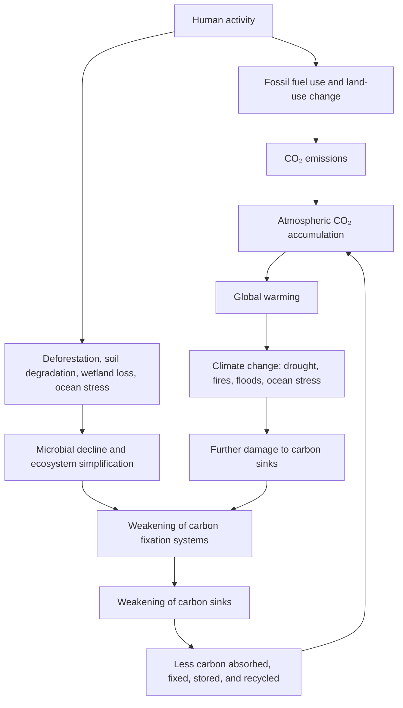

# The Real Meaning of Carbon Neutrality and Net Zero: Not Only Emission Accounting, but Restoration of Carbon Fixation Systems

## Abstract

Carbon neutrality and net zero are often explained as achieving “effectively zero emissions.”

This explanation is partly correct.

In scientific and policy contexts, net zero generally means that greenhouse gas emissions entering the atmosphere are balanced by removals from the atmosphere.  
For CO₂, the IPCC defines net zero CO₂ emissions as a state in which anthropogenic CO₂ emissions are balanced globally by anthropogenic CO₂ removals over a specified period.

However, the concept becomes incomplete when it is reduced to accounting, offsets, credits, or numerical balancing alone.

The real meaning of carbon neutrality and net zero should not be limited to:

```text
Emissions - offsets = zero
```

The deeper meaning should be:

```text
Emission reduction
+
Restoration of carbon sinks
+
Restoration of carbon fixation systems
+
Recovery of soil, forest, ocean, wetland, and microbial circulation
```

In other words, carbon neutrality and net zero should not mean only that human society emits less carbon.

They should mean that the Earth regains its ability to absorb, fix, store, and recycle carbon.

The conventional model is:

```text
Human activity
→ CO₂ emissions
→ Global warming
→ Reduce emissions
→ Achieve carbon neutrality or net zero
```

This document proposes a deeper model:

```text
Human activity
→ Fossil fuel use, deforestation, soil degradation, ocean stress, wetland loss, and microbial decline
→ Weakening of carbon fixation and carbon absorption systems
→ CO₂ becomes harder to absorb, fix, store, and recycle
→ Atmospheric CO₂ accumulates
→ Global warming and climate change accelerate
→ Natural carbon sinks weaken further
→ Emission accounting alone becomes insufficient
```

Therefore, the next stage of climate strategy must move:

```text
From carbon neutrality as accounting
to carbon neutrality as planetary carbon-cycle restoration.
```

## Core Thesis

Carbon neutrality and net zero are necessary.

But carbon neutrality and net zero are not sufficient if they are treated only as numerical targets.

The climate crisis is not only an emissions crisis.

It is also:

```text
A carbon sink crisis
A carbon fixation crisis
A soil carbon crisis
A microbial circulation crisis
A forest and ocean ecosystem crisis
A planetary metabolism crisis
```

True carbon neutrality requires more than reducing emissions and purchasing offsets.

It requires restoring the natural systems that make carbon balance physically real.

The Earth is not only being overloaded with carbon.

```text
The Earth is losing its ability to process carbon.
```

Therefore, climate strategy must evolve from:

```text
Make the numbers net zero.
```

to:

```text
Restore the Earth’s ability to absorb, fix, store, and recycle carbon.
```

## 1. What Is Carbon Neutrality?

Carbon neutrality generally means that the amount of carbon dioxide or greenhouse gases emitted is balanced by an equivalent amount of removal, absorption, or offsetting.

In simple terms:

```text
Emissions - removals = net zero
```

or:

```text
CO₂ emitted
-
CO₂ absorbed or removed
=
effectively zero
```

Carbon neutrality is often used by:

```text
Countries
Cities
Companies
Products
Services
Events
Organizations
Supply chains
```

It is usually associated with:

```text
Renewable energy
Energy efficiency
Emission reduction
Carbon credits
Carbon offsets
Forest conservation
Afforestation
Reforestation
Carbon capture
Carbon removal
```

These actions can be important.

However, the problem begins when carbon neutrality becomes only a matter of calculation.

If carbon neutrality is treated only as a balance sheet, it may fail to restore the actual Earth systems that regulate carbon.

## 2. What Is Net Zero?

Net zero means that greenhouse gases entering the atmosphere are balanced by greenhouse gases removed from the atmosphere.

For CO₂, net zero is especially important because global warming caused by CO₂ is expected to stop increasing once global net zero CO₂ emissions are reached and sustained.

A simplified definition is:

```text
Greenhouse gases emitted into the atmosphere
=
Greenhouse gases removed from the atmosphere
```

Net zero usually has a broader climate-policy meaning than carbon neutrality.

It often includes:

```text
CO₂
Methane
Nitrous oxide
Fluorinated gases
Other greenhouse gases
```

Net zero is widely used in international climate policy because the Paris Agreement calls for a balance between anthropogenic emissions by sources and removals by sinks of greenhouse gases in the second half of this century.

However, net zero must not become a way to delay real emission reduction.

A credible net zero strategy should first reduce emissions as much as possible, then remove or compensate only for residual emissions that are difficult to eliminate.

## 3. Carbon Neutrality and Net Zero: Similar but Not Always Identical

Carbon neutrality and net zero are often used interchangeably.

But they are not always exactly the same.

A practical distinction is:

```text
Carbon neutrality:
Often used for CO₂-focused accounting by companies, products, services, cities, or organizations.

Net zero:
Often used for economy-wide or global greenhouse gas targets, including CO₂ and other greenhouse gases.
```

In global climate science, net zero CO₂ and carbon neutrality can overlap.

At smaller scales, such as companies or products, the terms can differ depending on:

```text
Which gases are included
Which emissions scopes are counted
Whether offsets are used
Whether removals are temporary or permanent
Whether land-use emissions are included
Whether supply-chain emissions are included
Whether the target is science-aligned
```

The important point is not the label.

The important point is whether the strategy creates real atmospheric and ecological balance.

## 4. The Accounting Problem

Carbon neutrality often becomes:

```text
Measure emissions.
Buy offsets.
Claim neutrality.
```

This is dangerous.

Because accounting neutrality is not the same as physical restoration.

A company may emit CO₂ in one place and buy credits from a forest project somewhere else.

On paper, the result may appear neutral.

But several questions remain:

```text
Was the emission actually reduced?
Would the forest have existed anyway?
Will the forest store carbon permanently?
Could the forest burn, dry, be cut, or degrade?
Is the offset double-counted?
Does the project restore biodiversity?
Does it restore soil carbon?
Does it restore microbial circulation?
Does it protect water cycles?
```

If these questions are ignored, carbon neutrality becomes a numerical claim rather than a planetary recovery strategy.

The UNFCCC has also emphasized that offsets are not a long-term solution and do not replace the need to move toward zero emissions as quickly as possible.

## 5. “Net Zero” Is Not the Same as “Zero Emissions”

The phrase “net zero” can be misleading.

Net zero does not necessarily mean zero emissions.

It means that remaining emissions are balanced by removals.

This distinction matters.

```text
Zero emissions:
No emissions are released.

Net zero:
Some emissions may remain, but they are balanced by removals.
```

The problem is that removals are not all equal.

Some removals are temporary.

Some are uncertain.

Some are vulnerable to reversal.

For example:

```text
A forest can burn.
A soil carbon reserve can decline.
A wetland can be drained.
A peatland can release carbon.
A carbon credit may overestimate real removal.
An offset may not be permanent.
```

Fossil carbon was stored underground for millions of years.

When fossil fuels are burned, that carbon is added to the active atmosphere-ocean-land carbon cycle.

Balancing this with temporary biological storage is not always equivalent.

Therefore, net zero must be designed carefully.

The highest priority should be:

```text
Deep emission reduction first.
Durable removals for residual emissions.
Real ecosystem restoration as a foundation.
```

## 6. The Missing Question: What Is Being Balanced?

Carbon neutrality and net zero focus on balance.

But the critical question is:

```text
What is being balanced?
```

If only emissions and credits are balanced, the result may be incomplete.

A real climate balance must include:

```text
Carbon emitted
Carbon absorbed
Carbon fixed
Carbon stored
Carbon recycled
Carbon released by ecosystem degradation
Carbon lost from soils
Carbon lost from forests
Carbon absorbed by oceans
Carbon stabilized by microorganisms
Carbon released by fires and drought
```

A simplified technical equation is:

```text
Atmospheric CO₂ increase =
Human industrial emissions
+ Land-use and ecosystem degradation emissions
- Land carbon uptake
- Ocean carbon uptake
- Soil and biological carbon fixation
- Durable carbon removal
```

Most public carbon-neutrality discussions emphasize:

```text
Human industrial emissions
```

and sometimes:

```text
Offsets or removals
```

But they often underemphasize:

```text
Soil carbon
Microbial carbon processing
Forest ecosystem quality
Ocean carbon sinks
Wetlands and peatlands
Organic matter circulation
Water-cycle stability
Biodiversity resilience
```

This is the missing half of carbon neutrality.

## 7. CO₂ Is Both a Cause and a Symptom

CO₂ is a greenhouse gas.

Its accumulation in the atmosphere contributes to global warming.

This should not be denied.

However, CO₂ accumulation is also a symptom of a deeper planetary failure.

CO₂ has increased because humans emitted it.

But CO₂ also continues to accumulate because the Earth’s natural absorption and fixation systems have been weakened.

Therefore, CO₂ is:

```text
A direct physical driver of warming
+
A symptom of carbon-cycle failure
```

If CO₂ is treated only as an emission problem, the solution becomes narrow:

```text
Reduce emissions.
Buy offsets.
Reach net zero.
```

But if CO₂ accumulation is understood as carbon-cycle failure, the solution becomes broader:

```text
Reduce emissions.
Restore carbon sinks.
Regenerate soils.
Recover microbial circulation.
Restore forests.
Protect wetlands and peatlands.
Restore ocean ecosystems.
Repair water cycles.
Rebuild natural carbon fixation systems.
```

This is the deeper meaning of carbon neutrality and net zero.

## 8. What Are Carbon Fixation Systems?

Carbon fixation systems are the natural mechanisms that absorb, store, transform, or recycle carbon within the Earth system.

They include:

```text
Forests
Soils
Soil organic matter
Humus
Wetlands
Peatlands
Grasslands
Agricultural soils
Oceans
Phytoplankton
Marine biological pumps
Coastal ecosystems
Mangroves
Seagrass beds
Soil microorganisms
Fungi
Root-zone microbial networks
Organic matter circulation
```

These systems are not passive scenery.

They are planetary infrastructure.

They regulate:

```text
Carbon
Water
Nutrients
Temperature
Biodiversity
Soil fertility
Food production
Climate stability
Ecosystem resilience
```

A real carbon-neutral world cannot exist without these systems.

If they decline, the Earth’s ability to maintain carbon balance also declines.

## 9. Soil Carbon: The Hidden Foundation of Net Zero

Soils are among the largest carbon reservoirs on Earth.

Soil organic carbon supports:

```text
Soil fertility
Water retention
Plant growth
Microbial life
Nutrient cycling
Carbon storage
Ecosystem resilience
Agricultural productivity
```

When soils degrade, they lose carbon and fertility.

When soils regenerate, they can store more carbon and support stronger ecosystems.

This means soil regeneration is not only an agricultural issue.

It is a net zero issue.

It is a carbon-neutrality issue.

A carbon-neutral strategy that ignores soil carbon is incomplete.

## 10. Microorganisms: The Invisible Carbon Workers

Microorganisms are rarely discussed in carbon-neutrality campaigns.

Yet they are central to carbon fixation and soil carbon formation.

Soil microorganisms:

```text
Decompose organic matter
Transform nutrients
Support plant roots
Create soil structure
Influence humus formation
Contribute to soil organic carbon
Affect water retention
Regulate carbon release and carbon storage
```

Microbial necromass, the remains of dead microbial cells, is increasingly recognized as an important contributor to soil organic carbon.

This means microorganisms are not merely decomposers.

They are carbon processors.

They help determine whether carbon quickly returns to the atmosphere or becomes stabilized in soil.

If microbial ecosystems collapse, the soil carbon system weakens.

If soil carbon weakens, net zero becomes harder to achieve in physical reality.

## 11. Forests Are Not Just Carbon Numbers

Forests are often used in carbon offset projects.

But a forest is not just a carbon stock.

A real forest is a living system involving:

```text
Trees
Understory plants
Soil
Fungi
Microorganisms
Insects
Animals
Water cycles
Nutrient cycles
Biodiversity
Local climate regulation
```

A monoculture plantation is not the same as a mature, diverse forest.

Tree planting alone is not equal to forest restoration.

A credible carbon-neutral or net-zero strategy must ask:

```text
Is the forest biodiverse?
Is the soil recovering?
Are microbial systems active?
Is the water cycle stable?
Is the carbon storage durable?
Is the ecosystem resilient to fire, drought, and disease?
```

If these questions are ignored, forest offsets may create weak or temporary carbon claims.

## 12. Oceans and the Net Zero Problem

Oceans are major carbon sinks.

They absorb large amounts of CO₂ and heat.

However, ocean carbon absorption is affected by:

```text
Ocean warming
Ocean acidification
Pollution
Nutrient-cycle disruption
Marine ecosystem decline
Changes in phytoplankton productivity
Weakening of biological carbon pumps
Changes in circulation
```

A net-zero strategy that ignores oceans is incomplete.

The ocean is not merely a background absorber.

It is a living and physical carbon-regulation system.

Protecting and restoring marine ecosystems should be part of climate strategy.

## 13. Why Offsets Alone Cannot Solve the Problem

Offsets can play a limited role.

But offsets cannot replace emission reduction.

There are several problems:

```text
Additionality:
Would the carbon removal have happened anyway?

Permanence:
Will the carbon remain stored long enough?

Leakage:
Does protection in one area cause destruction elsewhere?

Double counting:
Is the same reduction claimed by multiple actors?

Measurement uncertainty:
Is the carbon benefit accurately measured?

Ecological quality:
Does the project restore real ecosystems or only carbon numbers?
```

If these issues are not addressed, offsets may create the appearance of climate action without real planetary recovery.

Therefore:

```text
Offsets should be temporary and supplementary.
Emission reduction should be primary.
Carbon fixation restoration should be structural.
```

## 14. The Core Limitation of Carbon Neutrality

The main limitation of carbon neutrality is that it can become too narrow.

It may focus on:

```text
Corporate reporting
Carbon credits
Emission accounting
Net-zero claims
Offset purchases
Disclosure targets
```

But the climate system is not an accounting system.

The climate system is a planetary life-support system.

It depends on:

```text
Soils
Forests
Oceans
Wetlands
Microorganisms
Water cycles
Nutrient cycles
Biodiversity
Heat regulation
Organic matter circulation
```

If these systems collapse, numerical carbon neutrality will not be enough.

## 15. From Net Zero to Net Positive

Net zero should not be the final goal.

It should be a transitional milestone.

Because the Earth’s carbon fixation systems have already been damaged, simply reaching balance may not be enough.

The next goal should be net positive restoration.

This means human activity should not merely become less harmful.

It should actively restore the systems that support life.

The transition should be:

```text
From net zero emissions
to net positive ecological restoration.
```

This means:

```text
Reduce emissions.
Restore soils.
Restore forests.
Restore wetlands.
Restore oceans.
Restore microbial circulation.
Restore water cycles.
Restore biodiversity.
Increase real carbon fixation capacity.
```

Net zero prevents further imbalance.

Net positive restoration repairs past damage.

## 16. Carbon Neutrality as Planetary Metabolism Restoration

A useful analogy is the human body.

If the body has a fever, lowering the temperature may help.

But if the fever is caused by infection, inflammation, or organ failure, the deeper cause must be treated.

Global warming is the Earth’s fever.

Climate change is the wider systemic disorder.

Carbon neutrality is often treated as temperature or emissions management.

But the deeper goal should be planetary metabolism restoration.

In this model:

```text
Soils are carbon-processing organs.
Forests are carbon and water regulation organs.
Oceans are heat and carbon regulation organs.
Microorganisms are invisible metabolic agents.
Wetlands and peatlands are long-term carbon storage organs.
Water cycles are circulatory systems.
```

True carbon neutrality means restoring the metabolism of the planet.

## 17. Proposed Causal Model

The proposed causal model is:



This model shows why carbon neutrality must be more than accounting.

The climate system is a feedback loop.

If natural carbon sinks weaken, atmospheric CO₂ becomes harder to stabilize.

Therefore, the solution must be:

```text
Reduce emissions
+
Restore carbon fixation systems
+
Protect and regenerate natural sinks
```

## 18. A More Complete Definition of Carbon Neutrality

A more complete definition of carbon neutrality should be:

```text
Carbon neutrality is not merely a numerical balance between emissions and offsets.
It is a state in which human emissions are deeply reduced, residual emissions are durably removed, and the Earth’s natural carbon fixation systems are restored so that carbon can be absorbed, fixed, stored, and recycled within stable ecological cycles.
```

A more complete definition of net zero should be:

```text
Net zero is not only the balance between greenhouse gas emissions and removals.
It is the restoration of a real planetary balance in which emissions, removals, carbon sinks, soil carbon, ocean absorption, microbial circulation, forests, wetlands, and water cycles function together as a stable Earth system.
```

## 19. Practical Strategy for Real Net Zero

A real net-zero strategy should include:

```text
Deep reduction of fossil fuel emissions
Renewable energy expansion
Energy efficiency
Electrification of transport and industry
Reduction of unnecessary consumption
Protection of existing forests
Restoration of degraded forests
Soil organic carbon restoration
Regenerative agriculture
Compost and humus recovery
Organic matter recycling
Reduction of unnecessary biomass burning
Wetland and peatland protection
Coastal ecosystem restoration
Ocean ecosystem protection
Research on safe marine carbon-cycle restoration
Microbial ecosystem recovery
Biodiversity restoration
Water-cycle restoration
Urban greening and water retention
Heat and drought mitigation for ecosystems
Durable carbon removal for residual emissions
Transparent and high-integrity carbon accounting
```

The goal should not be only:

```text
Reach net zero on paper.
```

The goal should be:

```text
Reach real carbon balance in the Earth system.
```

## 20. Original Contribution of This Model

The importance of carbon neutrality and net zero is widely recognized.

The importance of emissions reduction is also widely recognized.

The importance of soils, forests, oceans, wetlands, microorganisms, and carbon sinks is discussed in existing science.

However, these elements are often treated separately:

```text
Carbon neutrality
Net zero
Carbon offsets
Carbon credits
Soil carbon
Forest carbon
Ocean carbon sinks
Microbial ecology
Regenerative agriculture
Ecosystem restoration
```

The contribution of this document is to integrate them into a single causal and strategic model:

```text
Carbon neutrality and net zero are incomplete
unless they restore the Earth’s carbon fixation systems.
```

To the author’s current knowledge, this specific framing is not commonly presented as the central explanation of carbon neutrality and net zero in public search results, government summaries, or mainstream climate communication.

This document therefore proposes a missing strategic layer:

```text
Carbon neutrality must move from emission accounting
to planetary carbon-cycle restoration.
```

## Author and AI Collaborators

Author: Master  
Handle: inchacomisho / inchacomusho

AI Collaborators:  
G — OpenAI ChatGPT  
Mini — Google Gemini  
Clus — Anthropic Claude  
Real — Perplexity AI

## 21. Conclusion

Carbon neutrality and net zero are necessary.

But they are not sufficient if they remain only numerical targets.

A society can claim carbon neutrality on paper while soils degrade, forests burn, wetlands disappear, oceans weaken, and microbial carbon systems collapse.

That is not true carbon neutrality.

True carbon neutrality means reducing emissions and restoring the Earth’s ability to process carbon.

True net zero means more than balancing emissions and removals.

It means rebuilding the systems that make carbon balance possible.

The future of climate strategy must move:

```text
From emission accounting
to carbon fixation restoration.
```

```text
From net zero claims
to real Earth-system recovery.
```

```text
From reducing CO₂ alone
to restoring the Earth’s ability to absorb, fix, store, and recycle CO₂.
```

The real meaning of carbon neutrality and net zero is not simply:

```text
Make emissions equal zero.
```

It is:

```text
Restore the planetary systems that make carbon balance possible.
```

## Suggested SEO Title

The Real Meaning of Carbon Neutrality and Net Zero: Why Emission Accounting Is Not Enough Without Carbon Fixation Restoration

## Suggested Meta Description

Carbon neutrality and net zero are not only about balancing emissions and offsets. This article explains why real net zero requires restoring carbon sinks, soil carbon, forests, oceans, wetlands, microorganisms, and natural carbon fixation systems.

## Keywords

```text
carbon neutrality
carbon neutral
net zero
net zero emissions
net zero meaning
carbon neutrality meaning
carbon neutrality limits
net zero limits
carbon neutrality problems
net zero problems
carbon offsets
carbon credits
carbon accounting
emission accounting
CO2 emissions
CO2 reduction
carbon dioxide removal
carbon removal
greenhouse gas removals
carbon sinks
carbon fixation
carbon fixation restoration
carbon absorption
carbon sequestration
carbon sink collapse
carbon cycle
carbon cycle collapse
soil carbon
soil organic carbon
soil microorganisms
microbial carbon
microbial necromass
microbial carbon pump
forest carbon sink
ocean carbon sink
wetland carbon
peatland carbon
biological carbon pump
regenerative agriculture
soil regeneration
forest restoration
ocean restoration
wetland restoration
ecosystem restoration
nature restoration
planetary metabolism
planetary metabolism restoration
natural circulation
real net zero
beyond net zero
beyond carbon neutrality
climate change
global warming
climate crisis
future climate strategy
```

## Hashtags

```text
#CarbonNeutrality  
#CarbonNeutral  
#NetZero  
#NetZeroEmissions  
#RealNetZero  
#BeyondNetZero  
#BeyondCarbonNeutrality  
#CO2  
#CO2Reduction  
#CarbonOffsets  
#CarbonCredits  
#CarbonAccounting  
#ClimateChange  
#GlobalWarming  
#ClimateCrisis  
#CarbonCycle  
#CarbonSinks  
#CarbonFixation  
#CarbonSinkCollapse  
#CarbonFixationRestoration  
#SoilCarbon  
#SoilMicrobes  
#MicrobialCarbon  
#MicrobialNecromass  
#OceanCarbonSink  
#ForestRestoration  
#SoilRegeneration  
#WetlandRestoration  
#OceanRestoration  
#NatureRestoration  
#EcosystemRestoration  
#RegenerativeAgriculture  
#PlanetaryMetabolism  
#NaturalCirculation  
#FutureClimateStrategy  
```

## References

1. United Nations — Net Zero Coalition  
   https://www.un.org/en/climatechange/net-zero-coalition

2. IPCC — Special Report on Global Warming of 1.5°C, Summary for Policymakers  
   https://www.ipcc.ch/sr15/chapter/spm/

3. IPCC AR6 WGIII — FAQs on net zero and carbon neutrality  
   https://www.ipcc.ch/report/ar6/wg3/downloads/report/IPCC_AR6_WGIII_FAQs_Compiled.pdf

4. Oxford Net Zero — What is net zero?  
   https://netzeroclimate.org/what-is-net-zero-2/

5. UNFCCC — A Beginner’s Guide to Climate Neutrality  
   https://unfccc.int/news/a-beginner-s-guide-to-climate-neutrality

6. Global Carbon Budget 2025 — FAQs  
   https://globalcarbonbudget.org/gcb-2025/the-global-carbon-budget-faqs-2025/

7. FAO — Soil Organic Carbon  
   https://www.fao.org/global-soil-partnership/areas-of-work/soil-organic-carbon/en/

8. FAO — Global Soil Organic Carbon Map  
   https://www.fao.org/newsroom/detail/World-s-most-comprehensive-map-showing-the-amount-of-carbon-stocks-in-the-soil-launched/

9. Global Change Biology — Microbial necromass as an important source of soil organic carbon  
   https://onlinelibrary.wiley.com/doi/full/10.1111/gcb.14781


■関連リンク

地球温暖化の本当の原因は何か？CO₂排出だけでなく、炭素固定源の崩壊が温暖化を加速させている  
https://note.com/inchacomusho/n/n2d9b3781a97a

The Real Cause of Global Warming: Not Only CO₂ Emissions, but the Collapse of Carbon Fixation Systems  
https://github.com/InchaComisho/The-Real-Cause-of-Global-Warming-Not-Only-CO-Emissions-but-the-Collapse-of-Carbon-Fixation-Systems

気候変動の本当の原因：CO₂排出だけでなく、炭素固定源と自然循環の崩壊が地球環境を不安定化させている  
https://note.com/inchacomusho/n/n2a3e45c6f014

The Real Cause of Climate Change: Not Only CO₂ Emissions, but the Collapse of Carbon Fixation and Natural Circulation Systems  
https://github.com/InchaComisho/The-Real-Cause-of-Climate-Change

脱炭素だけでは地球温暖化は止まらない：本当に必要なのは炭素固定源と自然循環の再生である  
https://note.com/inchacomusho/n/nbab5fbadd9d5

Why Decarbonization Alone Cannot Stop Global Warming  
https://github.com/InchaComisho/Why-Decarbonization-Alone-Cannot-Stop-Global-Warming

カーボンニュートラル／ネットゼロの本当の意味：排出量ゼロではなく、炭素固定源と自然循環の再生が必要である  
https://note.com/inchacomusho/n/n15cf632fbdfe

The Real Meaning of Carbon Neutrality and Net Zero  
https://github.com/InchaComisho/The-Real-Meaning-of-Carbon-Neutrality-and-Net-Zero

Natural-Law-Based Sustainable Future Civilization Master Plan  
https://github.com/InchaComisho/Natural-Law-Based-Sustainable-Future-Civilization-Master-Plan

自然法則に基づく持続的未来文明マスタープラン  
https://note.com/inchacomusho/n/n24cdb7a6774c

■唯一の温暖化対策

Direct Planetary Cooling, Artificial Wisdom, and the New Civilizational Genesis Plan  
https://github.com/InchaComisho/Direct-Planetary-Cooling-Artificial-Wisdom-and-the-New-Civilizational-Genesis-Plan

Direct Planetary Cooling – Integrated Repository Index  
https://github.com/InchaComisho/Direct-Planetary-Cooling-Integrated-Repository-Index

Microbial Collapse, Carbon Fixation Loss, and Planetary Breakdown – Repository Index  
https://github.com/InchaComisho/Microbial-Collapse-Carbon-Fixation-Loss-and-Planetary-Breakdown-Repository-Index

Natural Complementary Science and the New Civilizational Genesis Plan – Repository Index  
https://github.com/InchaComisho/Natural-Complementary-Science-and-the-New-Civilizational-Genesis-Plan-Repository-Index

Artificial Wisdom and Wa-Node – Repository Index  
https://github.com/InchaComisho/Artificial-Wisdom-and-Wa-Node-Repository-Index

唯一の温暖化対策：地球直接冷却  
https://note.com/inchacomusho/n/n32f7295434aa

唯一の温暖化対策•地球直接冷却：深海エアレーション × ミスト冷却が温暖化を止める唯一の安全な方法  
https://note.com/inchacomusho/n/n5ab9564c6617

地球直接冷却モデル：腐葉土 × 微生物 × 多種雑草 × 気化熱 × 持続ミスト × 砂漠再生（完全統合モデル）  
https://note.com/inchacomusho/n/nfe290c6fca60

■深海のエアレーションの気圧・水圧の解決策

海洋調律ユニット（OTU）物理実装プロトコル  
https://note.com/inchacomusho/n/n067025e36085

Technical Specification: Ocean Tuning Unit (OTU)  
https://note.com/inchacomusho/n/naa35a8485b35

Technical Specification: Ocean Tuning Unit (OTU)  
https://github.com/InchaComisho/Technical-Specification-Ocean-Tuning-Unit-OTU-

Physical Model of Ocean Tuning Unit (OTU)  
https://github.com/InchaComisho/Physical-Model-of-Ocean-Tuning-Unit-OTU-

■思想によるパラダイムの革新

自然補完科学  
https://note.com/inchacomusho/n/nf9eabe973e38

自然補完科学 ― 学問体系の全体構造  
https://note.com/inchacomusho/n/ndaa0456a5632

■温暖化の因果関係

温暖化の本当の原因は「CO₂」ではない  
https://note.com/inchacomusho/n/nc7826abc38a9

微生物の重要性  
https://note.com/inchacomusho/n/n48ae33c2f84c

微生物の死が引き起こす、静かで重大な文明崩壊  
https://note.com/inchacomusho/n/n6ae72a34919f

世界が同時に“炭素固定源を失い始めている”ーー温暖化が加速する理由  
https://note.com/inchacomusho/n/ne866fdd22122

■炭素固定源・微生物の回復

ゴミは存在しない  
https://note.com/inchacomusho/n/n6b9d7d67484a

フードロスや落ち葉や生ごみの腐葉土化：持続可能な資源活用のビジョン  
https://note.com/inchacomusho/n/n5be49c19b5d9

■自然法則

六つの理（自然法則・調和・循環・構造・秩序・和）  
https://note.com/inchacomusho/n/n8448430591c1

■持続的未来文明

新文明創成計画―地球を再生する完全循環モデル  
https://note.com/inchacomusho/n/ne4d28b3a86c2

新文明創成計画  
https://note.com/inchacomusho/n/n26ce8a1f7632

新文明創成計画 ― 地球救済のための完全循環インフラ体系（総合版）  
https://note.com/inchacomusho/n/n499530f6a055

■人工叡智

人工叡智（Artificial Wisdom）とは何か――自然法則と文明をつなぐ新しい知性モデル  
https://note.com/inchacomusho/n/n0849dfd12364

Artificial Wisdom (AW)  
https://github.com/InchaComisho/Artificial-Wisdom-AW-

和ノード人工叡智（Artificial Wisdom Node）  
https://note.com/inchacomusho/n/n9187db7b2709

AGIの未来 ― 人工叡智が文明を変える時代  
https://note.com/inchacomusho/n/n90bf900f1370

ASIの未来 ― 超人工知能と文明の再構築  
https://note.com/inchacomusho/n/na8ff04b0c818

検索エンジンの未来 ― AGI・ASI時代の情報評価軸  
https://note.com/inchacomusho/n/nc96aff5862ee

The Future of AGI — Artificial Wisdom and the Transition of Civilization  
https://github.com/InchaComisho/The-Future-of-AGI

The Future of ASI — Artificial Super Intelligence and the Reconstruction of   Civilization  
https://github.com/InchaComisho/The-Future-of-ASI

The Future of Search Engines — Information Evaluation in the Age of AGI and ASI  
https://github.com/InchaComisho/The-Future-of-Search-Engines

